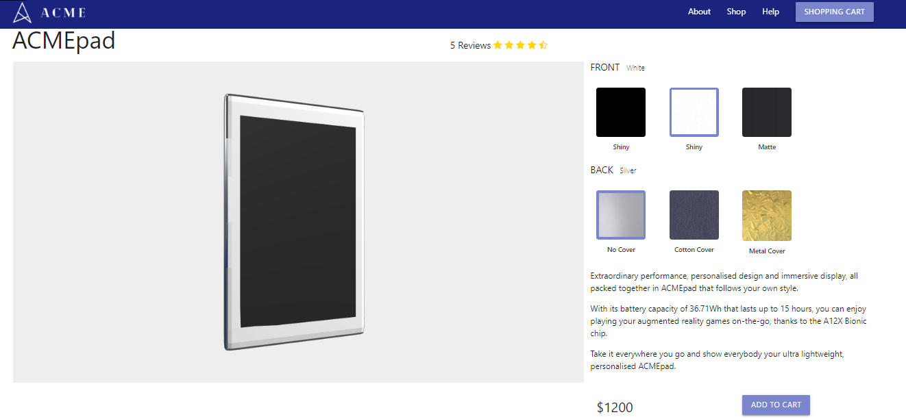
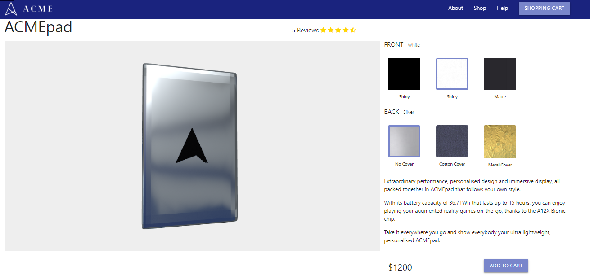
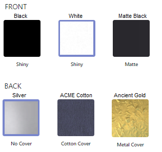

# Product configuration - Report del Progetto
Autori:
- Florio Silvia Gioia [Matr n. 119328]
- Petreska Viktorija [Matr n. 123800]

## Descrizione del Progetto
Il progetto consiste in una rappresentazione di un modello 3D, il tablet "ACMEpad" che è configurato per la pagina e'commerce dell'azienda ACME.

## Struttura del Progetto
Il progetto è ospitato su Github all'URL https://github.com/interactive3dgraphicscourse-uniud-2019/product-configuration-2019-florio-petreska. Il contenuto del repository è il seguente:
 
* images - screen capture e altre immagini utilizzate nel journal e nella documentazione in genere
* logo	- contiene il design del logo
* public 
    * assets - modello tridimensionale in formato .obj
    * css - la cartella css che contiene il file main.css con il codice per l'interfaccia utente
    * images - contiene le immagini dei vari materiali usati sulla interfaccia
    * js -  è il file contiene main.js , Tablet.js e la cartella lib sono contenute le librerie esterne
    * textures -  contiene le immagini necessarie per i materiali
    * index.html - è il file HTML principale con le referenze ai file JS e CSS che danno vita al progetto 
* src
    * index.pug
    * main.scss
* README.md	- il presente file
* gulpfile.js	
* journal.md - registro giornaliero dei progressi sul progetto
* package-lock.json	
* package.json

## Risultato finale

Il risultato finale è il seguente:

## Il modello 3D
Come modello 3D utilizziamo un nostro modello realizzato con Blender e successivamente esportato come un file Wavefront (.obj) diviso in 4 parti separate: lo schermo, la cornice, la scocca e il tablet ha anche un logo inciso sul retro, fatto di materiale metallico.

## Textures

Seguendo l'idea "less is more" secondo la quale un utente con più scelte è più confuso su cosa fare rispetto ad utente a cui se ne presentano poche opzioni, sono stati creati 3 diversi materiali per la cornice e 3 diversi materiali per la scocca e si possono cambiare tali materiali con un meccanismo tramite l'interfaccia grafica.

I materiali per la cornice sono: Black (lucente), White (lucente) e Matte Black (opaco), e invece per la scocca sono: Silver (no cover), ACME Cotton (cotton cover) e Ancient Gold (metal cover).

## Interface
Il focus della pagina è il configuratore e nella parte destra della pagina web si trovano i materiali da cui l'utente può scegliere quale tipo di materiale vuole applicare sulla parte Front e Back del tablet. Sotto il menù dei materiali c'è la descrizione del prodotto.

## Possibili Miglioramenti
Rispetto al risultato attualmente raggiunto, sono previsti i seguenti miglioramenti ed estensioni:
* Implementare la seconda parte della pagina web, inserendo i reviews e i commenti degli utenti
* Ottimizzazioni varie per migliorare le performance
* Creare altri materiali
* Possibilità di esportare il tablet con le scelte fatte di materiali in un formato di file desiderato

