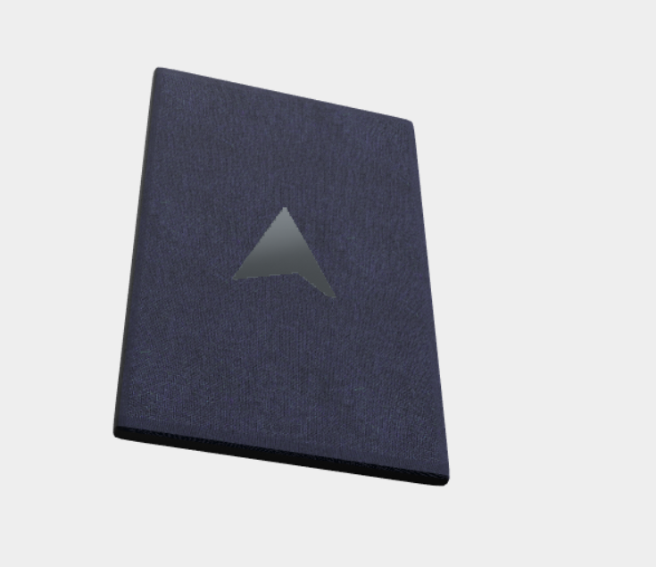

# Product configuration - Report del Progetto
Autori:
- Florio Silvia Gioia [Matr n. 119328]
- Petreska Viktorija [Matr n. 123800]

## Descrizione del Progetto
Il progetto consiste in una rappresentazione di un modello 3D, il tablet "ACMEpad" che viene configurato e personalizzato tramite la pagina e-commerce dell'azienda ACME.


## Struttura del Progetto
Il progetto è ospitato su Github all'URL https://github.com/interactive3dgraphicscourse-uniud-2019/product-configuration-2019-florio-petreska. 

Il contenuto del repository è il seguente:

```
product-configuration-2019-florio-petreska
|
├── images/
|
├── logo/
|
├── public/
|   |
|   ├── js/
|   |   |
|   |   ├── imports/   
|   |   |
|   |   ├── lib/   
|   |   |
|   |   └── main.js 
|   |
|   ├── css/
|   |   |
|   |   └── main.js 
|   |   
|   ├── images/
|   |
|   ├── textures/
|   |
|   ├── video/
|   |
|   ├── journal.md
|   |
|   ├── README.md
|   |
|   └── index.html
|
├── src/
|   |
|   ├── sass/
|   |   |
|   |   └── main.scss
|   |
|   └── index.pug
|
├── README.md
|
├── gulpfile.js
|
├── journal.md
|
└── package.json
```
 
Il contenuto di file e cartelle è:
- `public/` è la cartella che contiene la versione pubblica dell'applicazione web, ovvero la parte che ipoteticamente andrebbe trasferita sul server a lavoro compiuto e contiene
    - `assets/` contiene il modello tridimensionale in formato .obj
    - `css/main.css` il foglio di stile minimizzato per l'interfaccia (include al suo interno anche il foglio di stile della libreria esterna [materialize.css](https://materializecss.com/))
    - `images/` contiene le immagini utili all'interfaccia utente
    - `js/lib/` contiene le librerie di THREE js utilizzate
    - `js/Tablet.js` è il file dove sono racchiuse tutte le azioni riguardanti l'oggetto in vendita
    - `js/main.js` è il file con la gestione generale dell'applicazione
    - `textures/` contiene le immagini utili alla definizione dei materiali
    - `index.html` è il file (minimizzato) contenente il codice del markup e degli shader

- `src/` è la cartella che contiene i sorgenti per i file html e css, scritti utilizzando  rispettivamente [Pug](https://pugjs.org/api/getting-started.html) e [Sass](https://sass-lang.com/)

- `images/`contiene screen capture e altre immagini utilizzate nel journal e nella documentazione in genere

- `gulpfile.js` è il file di configurazione del task runner [Gulp](https://gulpjs.com/) utilizzato per compilare i file .pug e .scss 

- `journal.md` è il registro giornaliero dei progressi sul progetto

- `package.json` è il file di configurazione di [npm](https://www.npmjs.com/)

- `README.md` il presente file


## Risultato finale

Il risultato finale è il seguente:


### Prestazioni
Il frame-rate della scena, testato utilizzando un Dell G3 3579 con Intel i7-8750H, 16GB di RAM e Nvidia GTX1060 Max-Q, è in media di circa **700 fps** su Windows 10 Pro e Google Chrome Version 73.0.3683.86 (Official Build) (64-bit).

Su dispositivi mobili, testato su Safari con iPhone SE, iOS 12.3 e su Google Chrome su Xiaomi Mi A2 Lite, Android 9 il frame rate medio rilevato è di circa **400 fps**.

## Il modello 3D
Come modello 3D utilizziamo un nostro modello realizzato con Blender e successivamente esportato come un file Wavefront (.obj) diviso in 3 parti separate: lo schermo, la cornice e la scocca. 

Il tablet ha anche un logo inciso sul retro, fatto di materiale metallico se la scocca è isolante e di materiale isolante se la scocca è metallica.

## Progettazione e sviluppo
Abbiamo per prima cosa guardato ad esempi reali di e-commerce che vendono prodotti simili al nostro modello e studiato come realizzare l'interfaccia. 

Dopodiché abbiamo iniziato lo sviluppo e proceduto a piccoli passi, iniziando con una soluzione "sufficiente" che sfruttava uno shader personalizzato combinato e la realizzazione dei primi tre materiali, per poi aggiungere alla scena materiali più complessi e un numero maggiore di luci e meccanismi di illuminazione ambientale.

## Materiali


Seguendo l'idea "less is more" secondo la quale un utente con più scelte è più confuso su cosa fare rispetto ad un utente a cui si presentano poche opzioni, sono stati creati 3 diversi materiali per la cornice e 3 diversi materiali per la scocca e si possono cambiare tali materiali tramite l'interfaccia grafica.

I materiali per la cornice sono: nero lucido, bianco lucido e nero opaco.

I materiali per la scocca sono: metallo argentato (con logo in tessuto nero), cotone color indigo - il colore del brand - (con logo in argento) e mettallo color oro antico (con logo in plastica opaca nera).

## Interfaccia
Il focus della pagina è il configuratore e nella parte destra della pagina web si trovano i materiali da cui l'utente può scegliere quale tipo di materiale vuole applicare sulla parte Front e Back del tablet. Sotto il menù dei materiali c'è la descrizione del prodotto.

## Gli Shader
Gli shader sono stati scritti a partire dagli shader visti in classe, cercando di applicare i miglioramenti suggeriti dal professore. 

Inoltre è stata aggiunta la possibilità di passare allo shader due materiali (uno con texture e uno senza) e un'immagine in bianco e nero che funzionerà come selettore del materiale utilizzare per lo specifico pixel, con il seguente risultato:




## Possibili Miglioramenti
Rispetto al risultato attualmente raggiunto, sono possibili i seguenti miglioramenti ed estensioni:
* Implementare la seconda parte della pagina web, inserendo i reviews e i commenti degli utenti
* Possibilità di esportare il tablet con le scelte fatte di materiali in un formato di file desiderato
* Miglioramento dello shader con la selezione del doppio materiale di modo che si possano scegliere anche due materiali con texture o due materiali senza texture


## Risorse
* 3D: [three.js](https://threejs.org/)
* Textures scaricate da
    * https://beta.gametextures.com/shop/623776 - cotone
    * https://www.textures.com/download/pbr0152/133187 - oro antico

  e successivamente importate in Substance B2M per una personalizzazione e da lì esportate in jpeg
* Pacchetto di immagini HDR artificiali scaricato da https://gumroad.com/l/StudiolightSet05 e successivamente trasformato in cube map con https://matheowis.github.io/HDRI-to-CubeMap/
* Risorse per lo sviluppo della pagina web
    * [npm](https://www.npmjs.com/)
    * [Gulp](https://gulpjs.com/) 
    * [Pug](https://pugjs.org/api/getting-started.html) 
    * [Sass](https://sass-lang.com/)


