## 05/06/2019
### Idea
Abbiamo deciso di sviluppare la pagina di presentazione dell'ACMEpad un tablet con cornice e scocca personalizzabili con diverse combinazioni di materiali.

Il tablet ha anche un logo inciso sul retro, fatto di materiale metallico (simile alla mela Apple) e ci piacerebbe realizzare anche quello e far scegliere agli utenti tra diverse figure da incidere.

### Interfaccia
Abbiamo visitato qualche sito di elettronica e in particolare i siti Samsung e Apple per ispirarci nella progettazione dell'interfaccia.

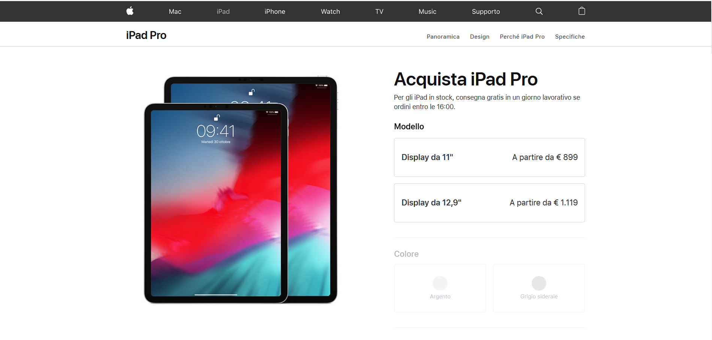
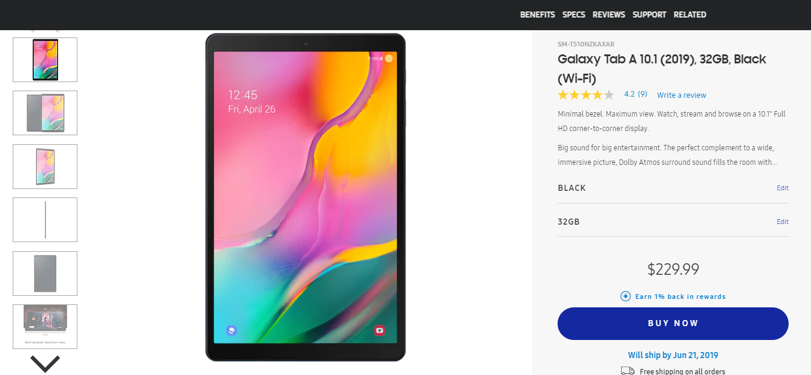

A questo punto abbiamo preparato uno sketch a mano con le posizioni dei principali elementi nella pagina e abbiamo concluso la progettazione con un mockup realizzato tramite il sito moqups (https://app.moqups.com/yV5e9Sb7Y0/view/page/a1bb9397e?ui=0)

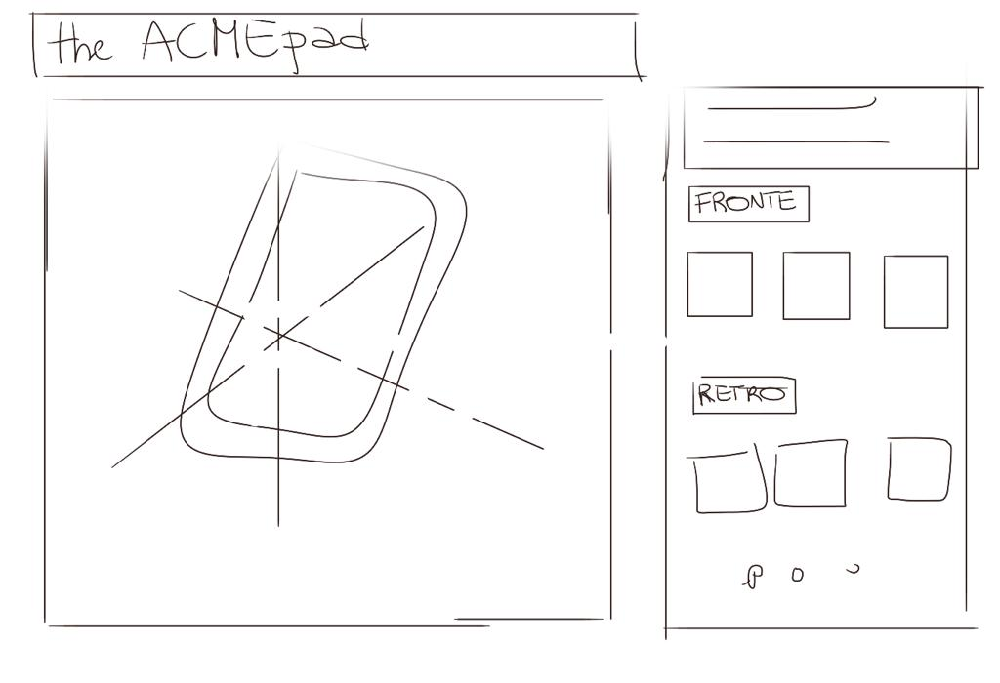
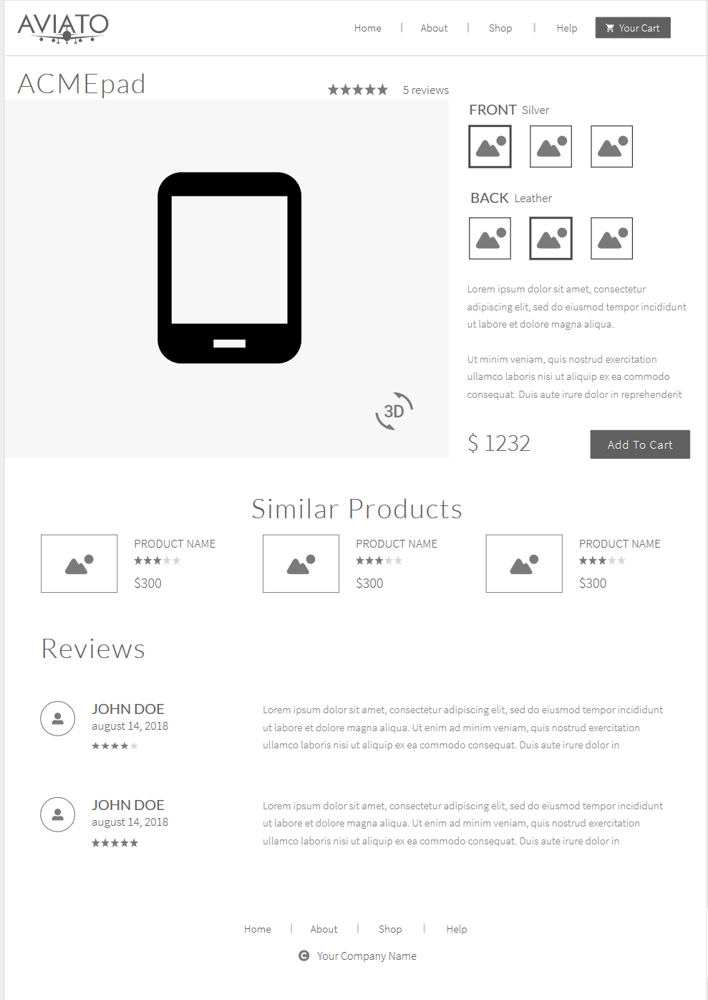

Il focus della pagina deve essere il configuratore, dunque ci concentreremo inizialmente sulla realizzazione della parte alta della pagina.

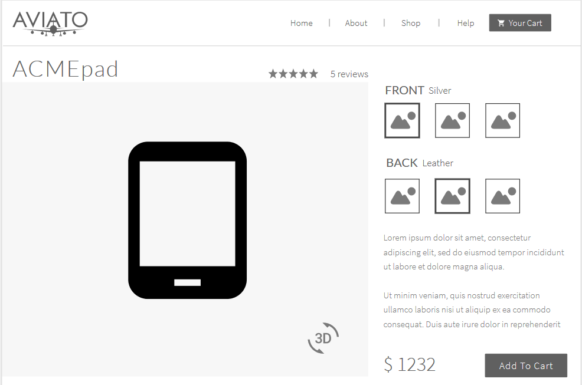

### Suddivisione del lavoro
Abbiamo deciso di iniziare con lo sviluppo di una semplice pagina web, per poi passare agli script veri e propri.

Inizialmente ci concentreremo su due materiali per la cornice e due materiali per la scocca.

Per quanto riguarda il modello 3D, utilizzeremo un modello creato da noi utilizzando Blender.

### Implementazione logo
Abbiamo fatto più versioni di design del logo. Il logo principale contiene una singola lettera "A" e il nome dell'azienda ACME. 
L'intero logo sarà usato nel titolo della pagina principale e invece la singola lettera ci piacerebbe usarla come logo sul tablet.

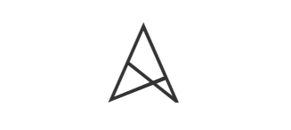
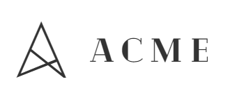
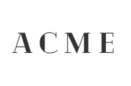

### Creazione avatar utenti
Abbiamo creato due avatar che saranno usati come le immagini profilo per gli utenti che hanno lasciato una review per il nostro prodotto.

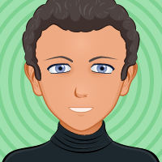

### Prodotti simili
Immagini di altri prodotti simili.

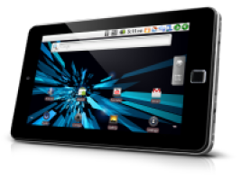
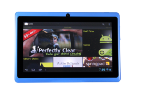
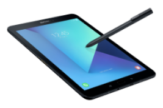

## 06/06/2019
### La pagina web
Abbiamo impostato la cartella per la realizzazione veloce di HTML e CSS grazie a Pug e Sass rispettivamente, utilizzando Gulp come task runner per i compilatori e per l'automazione del reload del browser quando i file vengono modificati.

Abbiamo quindi realizzato lo scheletro per la parte superiore della pagina web sfruttando il framework materialize css, che ha comportato una issue di vulnerabilità di bassa gravità che indagheremo meglio quando avremo finito la baseline del nostro progetto.

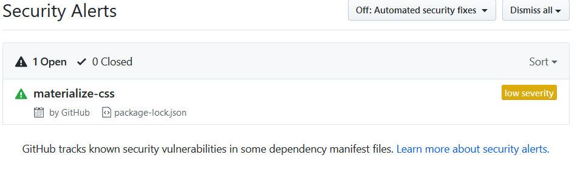

## 07/06/2019
### Il modello 3D
Come modello 3D utilizziamo un nostro modello realizzato con Blender e successivamente esportato  come un file Wavefront (.obj) diviso in 4 parti separate: lo schermo, la cornice, il logo e la scocca.

### Caricamento del modello sulla pagina
Per importare il file nella scena, abbiamo incluso gli script OBJLoader2 e LoadingSupport.js nel file HTML. 

Abbiamo quindi creato una classe per il Tablet che si occupa di gestirne i materiali e le geometrie, oltre che il caricamento.

Dopodichè abbiamo caricato il tablet nel container apposito sulla interfaccia, abbiamo fatto una prova semplice con alcuni cambiamenti del colore dei materiali delle 4 parti.
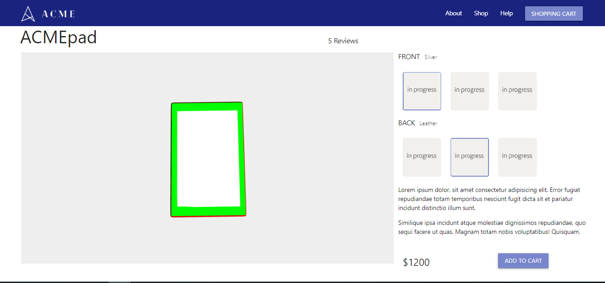

Infine abbiamo provato a riutilizzare il codice dello shader lambertiano visto a lezione per assegnare un nuovo materiale elaborato con lo shader alla scocca del nostro ACMEpad

## 11/06/2019
Abbiamo iniziato ad assegnare qualche materiale al tablet partendo dal shader combinato e speso molto tempo a cercare di tenere ferma la luce e girare solo l'oggetto, con scarso successo.

Abbiamo fatto una ricerca online per vedere quale è il modo migliore per l'illuminazione della fotografia di prodotto nella vita reale. Di solito vengono utilizzati 3 tipi di illuminazione, principale, backlight e luci di riempimento (spesso utilizzate 2).
La luce principale deve essere posizionata davanti o sulla parte superiore, spesso leggermente di lato, del prodotto, mentre la retroilluminazione è sul lato opposto, sul retro. Le luci di riempimento sono posizionate sui lati.

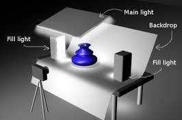
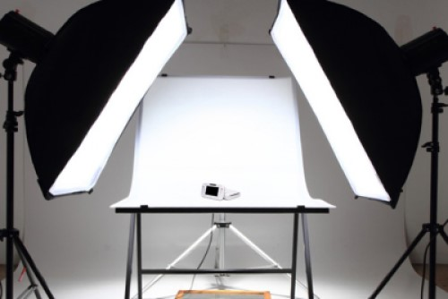

## 12/06/2019
Abbiamo cambiato lo shader per poter essere in grado di accetare più luci.

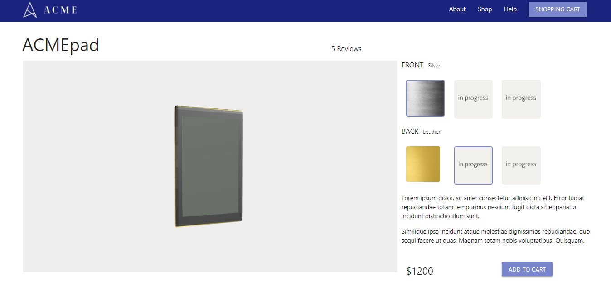
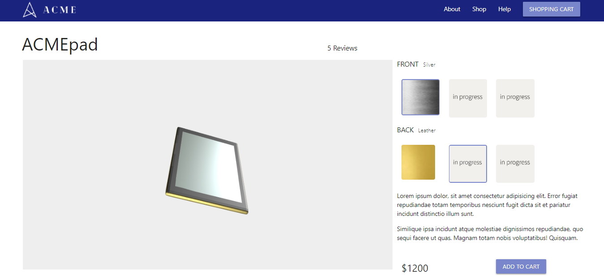
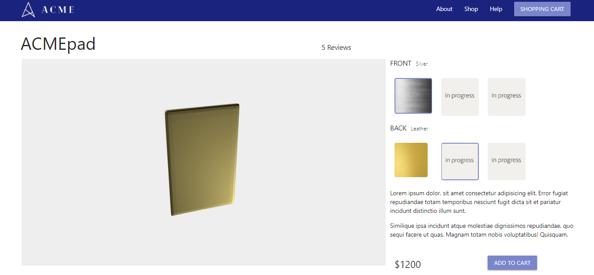
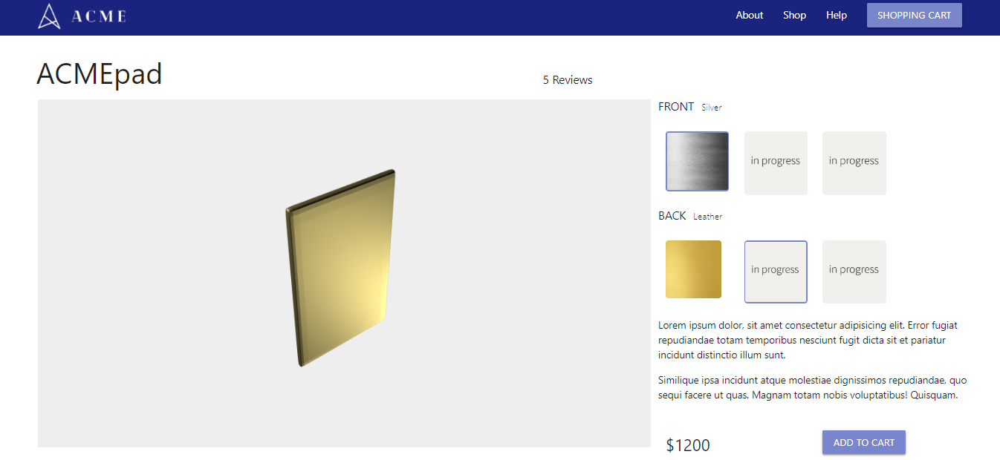

## 13/06/2019
Lo shader combinato è stato modificato per accettare in input un solo colore e un certo livello di metalness.

## 14/06/2019
Sono stati creati diversi materiali ed è stato implementato un meccanismo per cambiare tali materiali tramite l'interfaccia grafica.

https://3dtextures.me/2019/04/25/wood-wicker-003/

è stato integrato lo shader per la gestione delle textures ed è stato modificato per poter gestire più luci e una sola mappa di colore e il parametro metalness.

